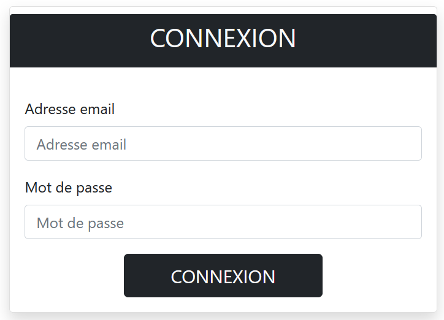
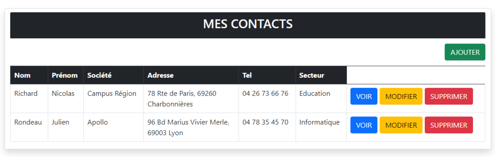
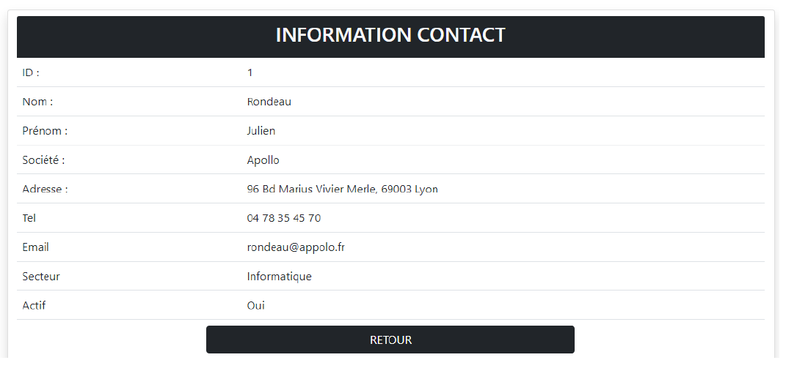
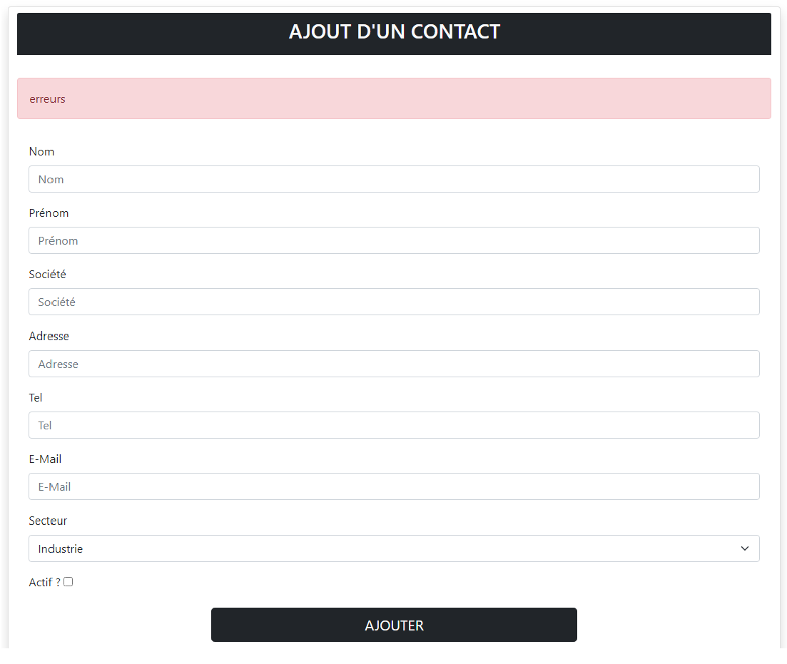

# Contact Pro Manager

## Description

Contact Pro Manager est une application web en **Node.js** utilisant **MongoDB** pour stocker et gérer vos contacts professionnels. L'application permet à un utilisateur authentifié de consulter, ajouter, modifier et supprimer ses contacts via une interface web ainsi qu'une API REST.

## Fonctionnalités

* **Authentification utilisateur** : Connexion avec email et mot de passe.
* **Gestion des contacts** :

  * Affichage de la liste des contacts
  * Consultation d'un contact détaillé
  * Ajout d'un nouveau contact
  * Modification d'un contact existant
  * Suppression d'un contact avec confirmation
* **API REST** : Manipulation des contacts et utilisateurs sans passer par l'interface.
* **Architecture MVC** :

  * **Views** : Contient toutes les pages de l'application
  * **Routes** : Déclaration des routes de l'application
  * **Controllers** : Traitement des données pour construire les pages
  * **Services** : Gestion et manipulation des données
* **Middleware** : Vérification de la session utilisateur avant l'accès aux pages protégées.

## Structure de la base de données

### Users

* Nom
* Prénom
* Adresse mail
* Mot de passe
* Contacts (référence aux contacts de l'utilisateur)

### Contacts

* Nom
* Prénom
* Société
* Adresse
* Téléphone
* Adresse mail
* Secteur (Industrie, Informatique, Santé, Éducation, …)
* User (référence à l'utilisateur propriétaire du contact)

## Prérequis

* Node.js
* MongoDB
* Postman (pour tester l'API)

## Installation

1. Cloner le dépôt :

```bash
git clone https://github.com/RukenDogan/contact-pro-manager-app.git
```

2. Installer les dépendances :

```bash
npm install
```

3. Configurer MongoDB :

   * Créer une base de données
   * Définir l'URI de connexion dans un fichier `.env`

4. Démarrer l'application :

```bash
npm start
```

5. Ouvrir Postman ou le navigateur pour accéder à l'application.

## Utilisation

* Accéder à la page de connexion
* S'authentifier avec email et mot de passe
* Consulter, ajouter, modifier ou supprimer des contacts via l'interface
* Tester les routes de l'API via Postman

## Routes principales

* `/login` : Connexion utilisateur
* `/contacts` : Liste des contacts
* `/contacts/:id` : Détails d'un contact
* `/contacts/add` : Ajouter un contact
* `/contacts/edit/:id` : Modifier un contact
* `/contacts/delete/:id` : Supprimer un contact

## Captures d'écran







